# Design Patterns Implementation Guide

## Overview

The Metro Fare Calculator has been enhanced with two powerful design patterns:

- **Strategy Pattern**: For flexible fare calculation and discount algorithms
- **State Pattern**: For managing the fare calculation workflow

## XML Documentation Generation

The project is configured to automatically generate comprehensive XML documentation files during build:

### 📋 **Configuration**
- **Main Project**: `FareCalculator.xml` generated in `bin/Debug/net8.0/`
- **Test Project**: `FareCalculator.Tests.xml` generated in test output directory
- **Complete API Documentation**: All public classes, methods, and properties documented with XML comments

### 🛠 **Build Settings**
```xml
<PropertyGroup>
  <GenerateDocumentationFile>true</GenerateDocumentationFile>
  <DocumentationFile>bin\$(Configuration)\$(TargetFramework)\$(AssemblyName).xml</DocumentationFile>
  <NoWarn>$(NoWarn);1591</NoWarn>
</PropertyGroup>
```

### 📖 **Documentation Features**
- **Comprehensive Coverage**: All interfaces, models, services, and states documented
- **Parameter Descriptions**: Detailed explanations of method parameters and return values
- **Exception Documentation**: All thrown exceptions documented with conditions
- **Design Pattern Explanations**: XML comments explain Strategy and State pattern implementations
- **Usage Examples**: Code examples and value descriptions for properties

## Strategy Pattern Implementation

### 🎯 **Purpose**
The Strategy pattern allows the system to dynamically choose different algorithms for fare calculation and discount application based on runtime conditions.

### 📋 **Key Components**

#### 1. Fare Calculation Strategies (`IFareCalculationStrategy`)
```csharp
public interface IFareCalculationStrategy
{
    string StrategyName { get; }
    Task<decimal> CalculateBaseFareAsync(FareRequest request);
    bool CanHandle(FareRequest request);
    int Priority { get; }
}
```

**Implementations:**
- `ZoneBasedFareStrategy` (Priority: 100) - Primary strategy for zone-based calculation
- `DistanceBasedFareStrategy` (Priority: 50) - Fallback strategy using GPS coordinates

#### 2. Discount Strategies (`IDiscountStrategy`)
```csharp
public interface IDiscountStrategy
{
    string StrategyName { get; }
    decimal ApplyDiscount(decimal baseFare, FareRequest request);
    bool AppliesTo(PassengerType passengerType);
    int Priority { get; }
}
```

**Implementations:**
- `PassengerDiscountStrategy` (Priority: 100) - Applies passenger type discounts
- `TimeBasedDiscountStrategy` (Priority: 90) - Applies peak/off-peak pricing

### 🔄 **Strategy Selection Process**

1. **Fare Calculation**: System selects the highest priority strategy that can handle the request
2. **Discount Application**: System applies all applicable discount strategies in priority order

### ✅ **Benefits**
- **Extensibility**: Easy to add new calculation methods (flat rate, premium zones, etc.)
- **Maintainability**: Each strategy is isolated and testable
- **Flexibility**: Runtime strategy selection based on request characteristics

## State Pattern Implementation

### 🎯 **Purpose**
The State pattern manages the fare calculation workflow as a series of well-defined states, each handling specific responsibilities.

### 📊 **State Workflow Diagram**

```mermaid
stateDiagram-v2
    [*] --> Initial : Start Calculation
    
    Initial --> BaseFareCalculation : Validate Request<br/>Initialize Context
    
    BaseFareCalculation --> DiscountApplication : Calculate Base Fare<br/>Select Strategy<br/>Get Distance/Zones
    
    DiscountApplication --> FinalCalculation : Apply Discounts<br/>Track Adjustments
    
    FinalCalculation --> [*] : Finalize Amount<br/>Generate Description<br/>Complete Response
    
    note right of Initial
        • Validate request data
        • Initialize context
        • Set up logging
        • Prepare response object
    end note
    
    note right of BaseFareCalculation
        • Select fare strategy by priority
        • Calculate base fare amount
        • Calculate distance between stations
        • Determine zone information
    end note
    
    note right of DiscountApplication
        • Find applicable discount strategies
        • Apply discounts in priority order
        • Track total discount amount
        • Maintain audit trail
    end note
    
    note right of FinalCalculation
        • Round final fare amount
        • Calculate zone count
        • Generate fare description
        • Complete response object
    end note
```



### 📋 **State Workflow**

#### 1. **Initial State** (`InitialCalculationState`)
- Validates the request
- Initializes the calculation context
- Sets up logging and metadata

#### 2. **Base Fare Calculation State** (`BaseFareCalculationState`)
- Selects appropriate fare calculation strategy
- Calculates base fare amount
- Collects distance and zone information

#### 3. **Discount Application State** (`DiscountApplicationState`)
- Applies all relevant discount strategies
- Tracks discount amounts and reasons
- Maintains audit trail of adjustments

#### 4. **Final Calculation State** (`FinalCalculationState`)
- Rounds final amount
- Generates fare description
- Prepares final response object

### 🔄 **State Transition Rules**
```
Initial → BaseFareCalculation → DiscountApplication → FinalCalculation
```

Each state validates transitions and maintains context integrity.

### 📊 **Context Object**
```csharp
public class FareCalculationContext
{
    public FareRequest Request { get; set; }
    public FareResponse Response { get; set; }
    public decimal CurrentFare { get; set; }
    public IFareCalculationState CurrentState { get; set; }
    public Dictionary<string, object> Data { get; set; }
    public List<string> ProcessingLog { get; set; }
}
```

### ✅ **Benefits**
- **Clarity**: Each state has a single responsibility
- **Maintainability**: Easy to modify individual steps
- **Debuggability**: Complete audit trail of processing steps
- **Extensibility**: Easy to add new states or modify workflow

## Dependency Injection Configuration

### Service Registration
```csharp
// Register strategy pattern implementations
services.AddScoped<IFareCalculationStrategy, ZoneBasedFareStrategy>();
services.AddScoped<IFareCalculationStrategy, DistanceBasedFareStrategy>();
services.AddScoped<IDiscountStrategy, PassengerDiscountStrategy>();
services.AddScoped<IDiscountStrategy, TimeBasedDiscountStrategy>();

// Register state pattern implementations
services.AddScoped<InitialCalculationState>();
services.AddScoped<BaseFareCalculationState>();
services.AddScoped<DiscountApplicationState>();
services.AddScoped<FinalCalculationState>();

// Register state machine
services.AddScoped<IFareCalculationStateMachine, FareCalculationStateMachine>();
```

## Example Execution Flow

### Input
```
Origin: Airport Express (Zone C)
Destination: Harbor View (Zone A)
Passenger: Adult
Time: 3:38 AM (Off-peak)
```

### Processing Log
```
1. Entering state: Initial
   - Initialized calculation at 2025-06-23 03:38:39
   - Route: Airport Express → Harbor View
   - Passenger: Adult
   - Travel Date: 2025-06-23 03:38

2. Entering state: BaseFareCalculation
   - Selected strategy: Zone-Based Calculation
   - Zone calculation: 3 zones = $5.00
   - Distance: 20.74 km

3. Entering state: DiscountApplication
   - Found 2 applicable discount strategies
   - Applied Passenger Type Discount: $5.00 → $5.00 (Adult: 0%)
   - Applied Time-Based Discount: $5.00 → $4.50 (Off-peak: -10%)

4. Entering state: FinalCalculation
   - Final fare: $4.50
   - Calculation completed at 2025-06-23 03:38:39
```

### Output
```
Fare Amount: $4.50 USD
Fare Type: Adult - Off-Peak Hours
Description: Journey from Airport Express to Harbor View. 
Calculated using Zone-Based Calculation strategy, covering 3 zone(s). 
Base fare: $5.00, Final fare after adjustments: $4.50
```

## Testing Strategy

### Unit Tests
- **Strategy Tests**: Test each strategy implementation independently
- **State Tests**: Test individual state processing logic
- **Integration Tests**: Test complete workflow scenarios

### Test Coverage
- 69 total tests (up from 45)
- Full coverage of both original and pattern-based implementations
- Backward compatibility maintained

## Extending the System

### Adding New Fare Calculation Strategy
```csharp
public class FlatRateFareStrategy : IFareCalculationStrategy
{
    public string StrategyName => "Flat Rate";
    public int Priority => 75;
    
    public bool CanHandle(FareRequest request) 
        => request.Origin.Zone == "EXPRESS";
    
    public Task<decimal> CalculateBaseFareAsync(FareRequest request)
        => Task.FromResult(3.00m);
}
```

### Adding New Discount Strategy
```csharp
public class GroupDiscountStrategy : IDiscountStrategy
{
    public string StrategyName => "Group Discount";
    public int Priority => 80;
    
    public bool AppliesTo(PassengerType passengerType) => true;
    
    public decimal ApplyDiscount(decimal baseFare, FareRequest request)
    {
        // Apply 15% discount for group bookings
        return request.Data.ContainsKey("GroupSize") && 
               (int)request.Data["GroupSize"] >= 5 
            ? baseFare * 0.85m 
            : baseFare;
    }
}
```

### Adding New Processing State
```csharp
public class ValidationState : IFareCalculationState
{
    public string StateName => "Validation";
    
    public Task<FareCalculationContext> ProcessAsync(FareCalculationContext context)
    {
        // Validate business rules before calculation
        ValidateStations(context.Request.Origin, context.Request.Destination);
        ValidateDateTime(context.Request.TravelDate);
        return Task.FromResult(context);
    }
    
    public bool CanTransitionTo(IFareCalculationState nextState)
        => nextState.StateName == "Initial";
}
```

## Architecture Benefits

### 🎯 **Single Responsibility Principle**
Each strategy and state has one clear purpose

### 🔓 **Open/Closed Principle**
Open for extension (new strategies/states) but closed for modification

### 🔄 **Dependency Inversion**
High-level modules depend on abstractions, not concretions

### 🧪 **Testability**
Each component can be tested independently with mock dependencies

### 📈 **Scalability**
Easy to add new fare rules, calculation methods, or processing steps

This pattern-based architecture makes the fare calculation system highly maintainable, extensible, and testable while preserving all existing functionality. 