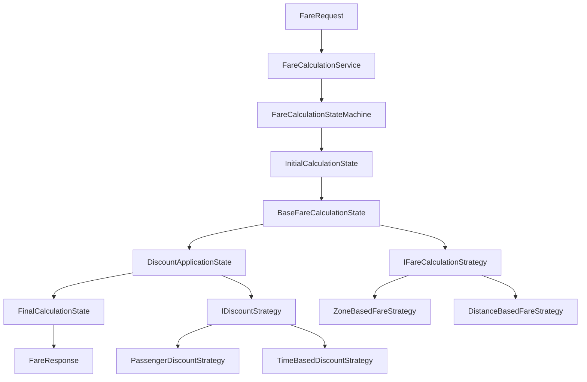

# This is the **HOMEPAGE**.

Refer to [Markdown](http://daringfireball.net/projects/markdown/) for how to write markdown files.

## Quick Start Notes:

1. Add images to the *images* folder if the file is referencing an image.

# Metro Fare Calculator Documentation

Welcome to the comprehensive documentation for the Metro Fare Calculator project - a sophisticated fare calculation system built with modern design patterns and best practices.

## 🚇 Project Overview

The Metro Fare Calculator is a .NET 8 console application that demonstrates the implementation of:

- **Strategy Pattern** for flexible fare calculation algorithms
- **State Pattern** for managing calculation workflows  
- **Dependency Injection** for loose coupling and testability
- **Comprehensive Testing** with 54 unit and integration tests
- **XML Documentation** for complete API coverage

## 🎯 Key Features

### Fare Calculation Strategies
- **Zone-Based Calculation**: Primary strategy using metro zone system
- **Distance-Based Calculation**: Fallback strategy using GPS coordinates
- **Priority-Based Selection**: Automatic strategy selection based on request characteristics

### Discount Strategies  
- **Passenger Type Discounts**: Child (50%), Senior (30%), Student (20%), Disabled (50%)
- **Time-Based Pricing**: Peak hour surcharges (+25%) and off-peak discounts (-10%)
- **Configurable Rules**: Easy to modify or extend discount policies

### State Machine Workflow
- **Initial State**: Request validation and context initialization
- **Base Fare Calculation**: Strategy selection and fare computation
- **Discount Application**: Multi-strategy discount processing
- **Final Calculation**: Amount rounding and response generation

## 📖 Documentation Sections

### [Design Patterns Implementation](articles/Design-Patterns-Implementation.md)
Detailed explanation of how Strategy and State patterns are implemented, including:
- Pattern structure and benefits
- Implementation examples
- Workflow diagrams
- Extension points

### [API Documentation Guide](articles/API-Documentation.md)  
Comprehensive API reference covering:
- Core interfaces and implementations
- Data models and enums
- Usage examples and scenarios
- XML documentation features

## 🏗️ Architecture



## 🚀 Quick Start

```csharp
// Create a fare request
var request = new FareRequest
{
    Origin = new Station { Id = 1, Name = "Downtown Central", Zone = "A" },
    Destination = new Station { Id = 6, Name = "Airport Express", Zone = "C" },
    PassengerType = PassengerType.Adult,
    TravelDate = DateTime.Now
};

// Calculate the fare
var response = await fareCalculationService.CalculateFareAsync(request);

// Result: $5.00 for 3-zone adult journey
Console.WriteLine($"Fare: {response.Amount:C} {response.Currency}");
```

## 🧪 Testing

The project includes comprehensive testing with:
- **54 Total Tests** covering all functionality
- **Unit Tests** for individual components
- **Integration Tests** for end-to-end workflows
- **Pattern Tests** for Strategy and State implementations
- **Error Handling Tests** for edge cases and exceptions

## 🛠️ Build and Documentation

### Building the Project
```bash
dotnet build
dotnet test
```

### Generating Documentation
```bash
# Install DocFX (if not already installed)
dotnet tool install -g docfx

# Generate documentation site
docfx docfx.json --serve
```

The documentation will be available at `http://localhost:8080`

## 📋 API Reference

Browse the complete [API Reference](api/index.md) for detailed information about:
- Public interfaces and their implementations
- Data models and their properties  
- Service classes and their methods
- Exception types and conditions

## 🤝 Contributing

When extending the system:

1. **Add New Strategies**: Implement `IFareCalculationStrategy` or `IDiscountStrategy`
2. **Extend Workflow**: Add new states implementing `IFareCalculationState`
3. **Update Tests**: Ensure comprehensive test coverage for new features
4. **Document Changes**: Update XML comments and markdown documentation

---

*This documentation is automatically generated from XML documentation comments and Markdown files. For the latest information, please refer to the source code and inline documentation.*