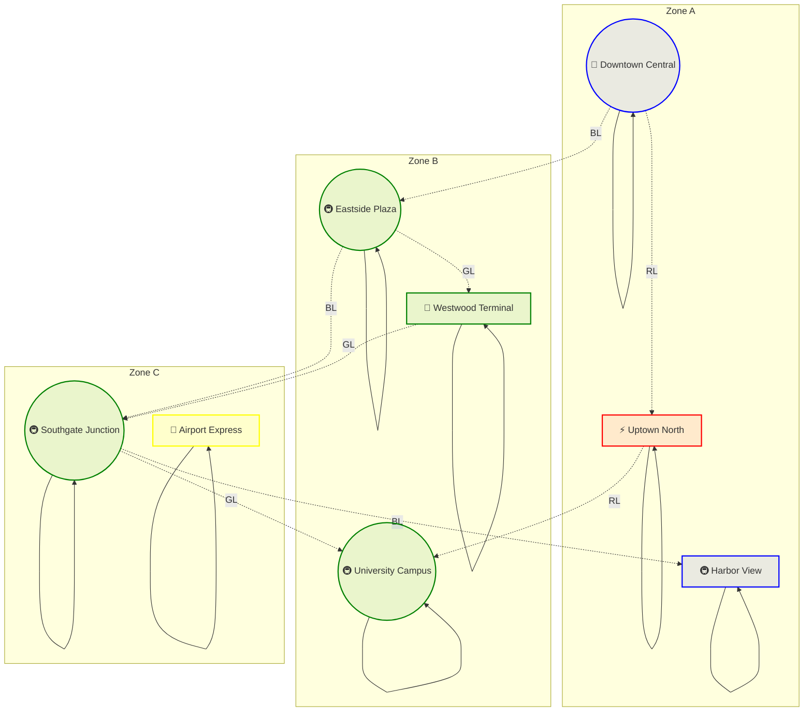

```mermaid
graph TB
    %% Metro System Map

    %% Stations by Zone
    subgraph ZoneA["Zone A"]
        S1(("🚉 Downtown Central"))
        S2["⚡ Uptown North"]
        S8["🚇 Harbor View"]
    end

    subgraph ZoneB["Zone B"]
        S3(("🚇 Eastside Plaza"))
        S4["🚉 Westwood Terminal"]
        S7(("🚇 University Campus"))
    end

    subgraph ZoneC["Zone C"]
        S5(("🚇 Southgate Junction"))
        S6["🚉 Airport Express"]
    end

    %% Metro Line Connections
    %% Red Line (RL)
    S1 -.->|RL| S2
    S2 -.->|RL| S7

    %% Blue Line (BL)
    S1 -.->|BL| S3
    S3 -.->|BL| S5
    S5 -.->|BL| S8

    %% Green Line (GL)
    S3 -.->|GL| S4
    S4 -.->|GL| S5
    S5 -.->|GL| S7

    %% Yellow Line (YL)

    %% Styling
    S1 --> S1
    style S1 fill:#FF000015,stroke:#FF0000,stroke-width:2px
    S2 --> S2
    style S2 fill:#FF000015,stroke:#FF0000,stroke-width:2px
    S7 --> S7
    style S7 fill:#FF000015,stroke:#FF0000,stroke-width:2px
    S1 --> S1
    style S1 fill:#0000FF15,stroke:#0000FF,stroke-width:2px
    S3 --> S3
    style S3 fill:#0000FF15,stroke:#0000FF,stroke-width:2px
    S5 --> S5
    style S5 fill:#0000FF15,stroke:#0000FF,stroke-width:2px
    S8 --> S8
    style S8 fill:#0000FF15,stroke:#0000FF,stroke-width:2px
    S3 --> S3
    style S3 fill:#00800015,stroke:#008000,stroke-width:2px
    S4 --> S4
    style S4 fill:#00800015,stroke:#008000,stroke-width:2px
    S5 --> S5
    style S5 fill:#00800015,stroke:#008000,stroke-width:2px
    S7 --> S7
    style S7 fill:#00800015,stroke:#008000,stroke-width:2px
    S6 --> S6
    style S6 fill:#FFFF0015,stroke:#FFFF00,stroke-width:2px
```
